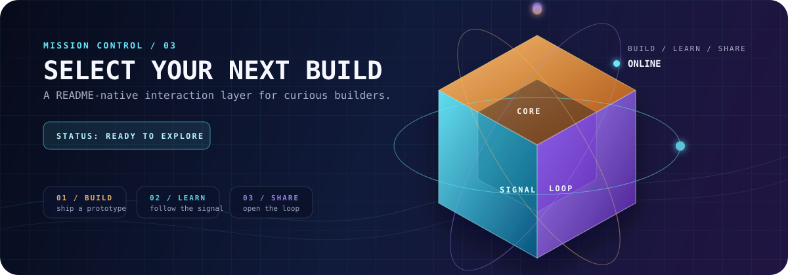

<div align="center">
  
</div>

<p align="center">
  <a href="https://sudipbhattarai0.com.np/"><strong>Open the portfolio</strong></a> ·
  <a href="https://github.com/Sudipsudip5250?tab=repositories">Browse the repositories</a> ·
  <a href="mailto:sudipsudip5250@gmail.com">Start a conversation</a>
</p>

> I turn curiosity into working software — exploring **Generative AI**, **data**, **full-stack systems**, and the open-source learning loop around them.

## ◈ About the lab

This profile is a living research surface rather than a trophy shelf. I try to understand systems from first principles, build the smallest proof that can teach me something, and share the useful part with enough context for another person to follow.

| Signal | Current direction |
|---|---|
| **Core interest** | Generative AI, language models, forecasting, and applied data science |
| **Build style** | Learn deeply, prototype quickly, then make the result useful |
| **Open-source energy** | Sharing experiments, datasets, educational tools, and practical notes |
| **Base** | Sunsari, Nepal |

## ⌁ Current exploration

The strongest thread right now sits between models and interfaces: how can a technical idea become a small, understandable, useful system? I am keeping the list honest; an idea stays an exploration until there is a real public repository, document, or working demo to link.

- Training and understanding language models from first principles.
- PyTorch, Transformer architectures, model conversion, and efficient inference.
- Flutter product development and thoughtful interface design.
- Practical data science, deployment workflows, and AI infrastructure.

## ✦ Public work

These are verified public projects and notes. The list is intentionally small so the profile points to real work rather than invented case studies.

| Repository | Focus |
|---|---|
| [`SudipOfficial`](https://github.com/Sudipsudip5250/SudipOfficial) | Portfolio, experiments, research notes, and an interactive contact experience |
| [`open-skillbox`](https://github.com/Sudipsudip5250/open-skillbox) | A modular, open-source library of reusable skills for AI agents |
| [`gcode-harness`](https://github.com/Sudipsudip5250/gcode-harness) | A Rust-based, multi-model coding-agent harness with multi-session workflows |
| [`airsi-algotrader`](https://github.com/Sudipsudip5250/airsi-algotrader) | Market research and paper-trading tooling built around bounded experiments |

### `identity.ts`

```ts
const sudip = {
  name: "Sudip Bhattarai",
  focus: ["Generative AI", "Data", "Full-stack development"],
  approach: "Learn deeply. Build honestly. Share openly.",
  status: "Exploring ideas and building in public",
};
```

## ◉ Mission control

<div align="center">
  
</div>

<details>
<summary><strong>▶ Choose your next mission</strong></summary>

<br />

> **Objective:** Pick one route. Every route leads to a different kind of useful work.

<details>
<summary><strong>01 / BUILD</strong> — turn an idea into a prototype</summary>

Start with the smallest version that can teach you something. Make one interaction feel good, test it with a real user, and publish the result with a short README.

**Reward unlocked:** `prototype thinking`

</details>

<details>
<summary><strong>02 / LEARN</strong> — follow the signal</summary>

Choose one unfamiliar concept, trace it back to first principles, and write down the explanation you wish you had found at the beginning.

**Reward unlocked:** `clearer questions`

</details>

<details>
<summary><strong>03 / SHARE</strong> — open the loop</summary>

Package the useful part of your experiment: the dataset, lesson, source code, or failure mode. Someone else should be able to learn from it without needing the whole backstory.

**Reward unlocked:** `open-source momentum`

</details>

</details>

## ⟡ Toolkit constellation

Tools are nodes. The loop is the system. I use the following technologies and practices as connected parts of the same process rather than as a scoreboard.

<div align="center">
  
</div>

| Domain | Working set |
|---|---|
| **Languages and interfaces** | Python, JavaScript, HTML, CSS, React, Flutter, Tailwind CSS, Node.js, Flask |
| **Machine learning and data** | PyTorch, TensorFlow, scikit-learn, NumPy, Pandas, SciPy, Transformers, data visualization |
| **Systems and delivery** | Rust, Git, GitHub Actions, Postman, Cloudflare, D1 |

## ◇ Project card language

Every public project follows the same visual contract: one clear title, one honest status, a compact stack, and a path to the source or live build.

<div align="center">
  
</div>

## ◉ System status

| Node | State | Open the loop |
|---|---|---|
| **Portfolio interface** | `LIVE` · Cloudflare Pages | [sudipbhattarai0.com.np](https://sudipbhattarai0.com.np/) |
| **Contact persistence** | `ONLINE` · Pages Function + D1 | [Open contact](https://sudipbhattarai0.com.np/root/contact/contact.html) |
| **Public work** | `CURATED` · verified repositories | [Browse projects](https://github.com/Sudipsudip5250?tab=repositories) |
| **Learning loop** | `ACTIVE` · notes, experiments, open source | [Read the profile](https://github.com/Sudipsudip5250) |

> **Signal rule:** shipped work gets a link, ideas get a label, and experiments get a clear status.

## ⟁ GitHub signal

<div align="center">
  
  
</div>

<div align="center">
  
</div>

## ◇ Research note

[Universe: The Pre-build Code](https://sudipbhattarai0.com.np/research/universe-the-pre-build-code) is a short note about framing an idea before building it: where a personal lens becomes a method, and where curiosity becomes a repeatable learning practice.

## ◌ Connect

The best conversations usually start with a shared problem, an unfinished experiment, or a question that does not have a clean answer yet.

<div align="center">
  <a href="https://www.facebook.com/sudipsudip525"></a>
  <a href="https://www.instagram.com/sudipsudip5250"></a>
  <a href="https://x.com/sudipsudip5250"></a>
  <a href="mailto:sudipsudip5250@gmail.com"></a>
</div>

<p align="center"><sub>Stay curious. Build boldly. Share what you learn.</sub></p>

<!-- Cyber-research visual system for Sudip Bhattarai. -->
