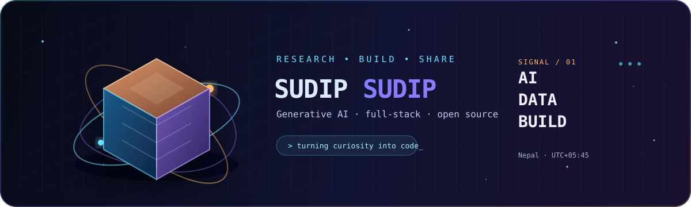

  

 

  
  
  

  <strong>Researcher · Generative AI creator · Full-stack developer</strong> 
  Building useful systems at the intersection of machine learning, data, education, and open source.

  <a href="#-about-me">About</a> ·
  <a href="#-what-im-building">Building</a> ·
  <a href="#-toolkit">Toolkit</a> ·
  <a href="#-github-signal">GitHub signal</a> ·
  <a href="#-lets-connect">Connect</a>

---

## ◈ About me

I turn curiosity into working software. My interests span **generative AI**, **machine learning**, **data products**, and **full-stack development**—with a bias toward projects that make learning, experimentation, or everyday work more useful.

I care about understanding systems from first principles, documenting what I learn, and sharing practical work openly. When I am not training models or shaping interfaces, I am usually exploring a new idea with a notebook, a terminal, and far too much coffee.

| Signal | Current direction |
|---|---|
| **Core interest** | Generative AI, LLMs, forecasting, and applied data science |
| **Build style** | Learn deeply, prototype quickly, then make the result useful |
| **Open-source energy** | Sharing experiments, datasets, and educational tools |
| **Collaboration** | AI/ML research, developer tools, education, and thoughtful UI/UX |

## ⌁ What I'm building

These are the problem spaces currently receiving my attention. The exact implementation may change, but the goal stays the same: make complex ideas easier to use.

| Project direction | What it explores |
|---|---|
| **Smart alarm app** | A Flutter experience that uses maths and logic challenges to help people start the day intentionally. |
| **NEPSE intelligence** | Forecasting experiments using market data, deep learning, and ARIMA-style time-series methods. |
| **Typing + reading platform** | An open-source learning environment that combines deliberate typing practice with focused reading. |
| **Generative AI experiments** | Small, human-centred models and prototypes that explore emotion, language, and useful interaction. |

> **Open to collaboration:** If you are working on an open-source AI, machine learning, research, or education project, I would be glad to hear what you are building.

<strong>⌘ Current learning queue</strong>

 

- Training and understanding language models from first principles.
- PyTorch, Transformer architectures, model conversion, and efficient inference.
- Flutter product development and polished interface design.
- Practical data science, deployment workflows, and AI infrastructure.

## ✦ Toolkit

I prefer tools that help me move from an idea to a reproducible result without losing the reasoning in between.

### Languages and application development

### Machine learning and data

### Workflow and delivery

## ⟁ GitHub signal

  
  

<strong>View the contribution profile</strong>

 

  

## ◌ Let's connect

The best conversations usually start with a shared problem, an unfinished experiment, or a question that does not have a clean answer yet.

  
  
  
  

 

  Thanks for stopping by. Stay curious, build boldly, and share what you learn.

<!-- Profile README designed for Sudip Sudip. -->
